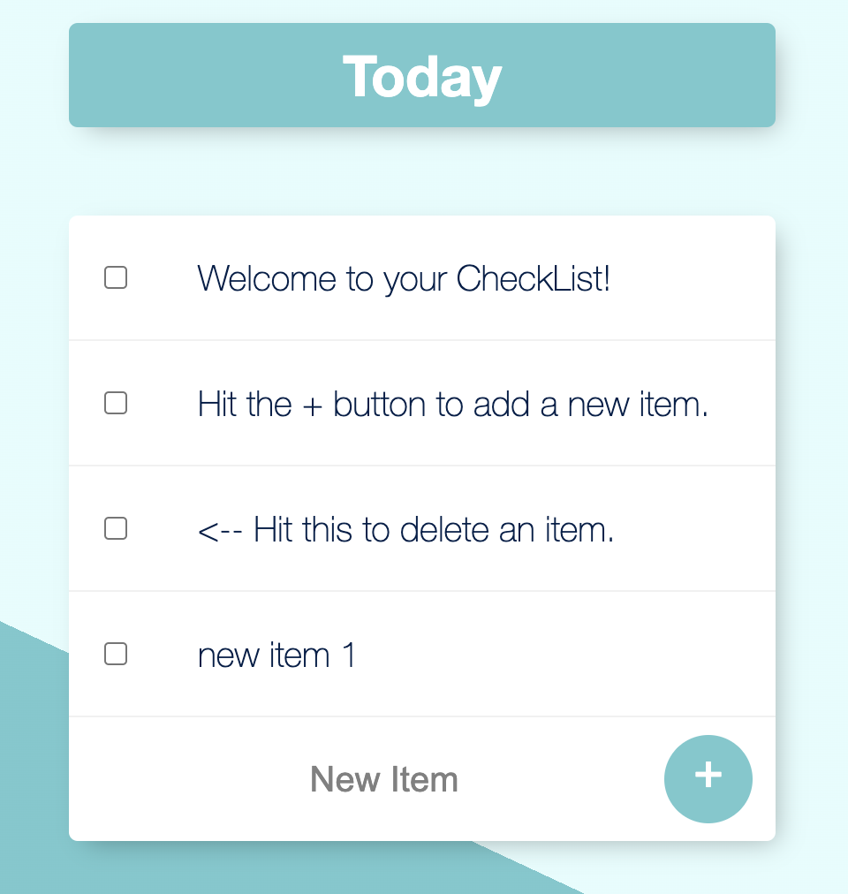

# cs103a-cpa02

This app is a todolist

The default page looks like this

To add a new item, enter the text in the box and click the plus botton

To delete a added item, click the check box to the left

*******************************

To install and run the app locally, simply use npm to install all the required packages and cd in to the folder, then use node app.js to run it on the port you set in the app.js file